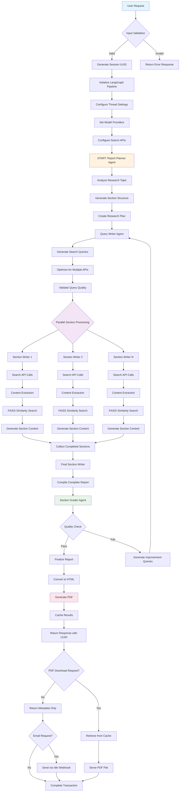
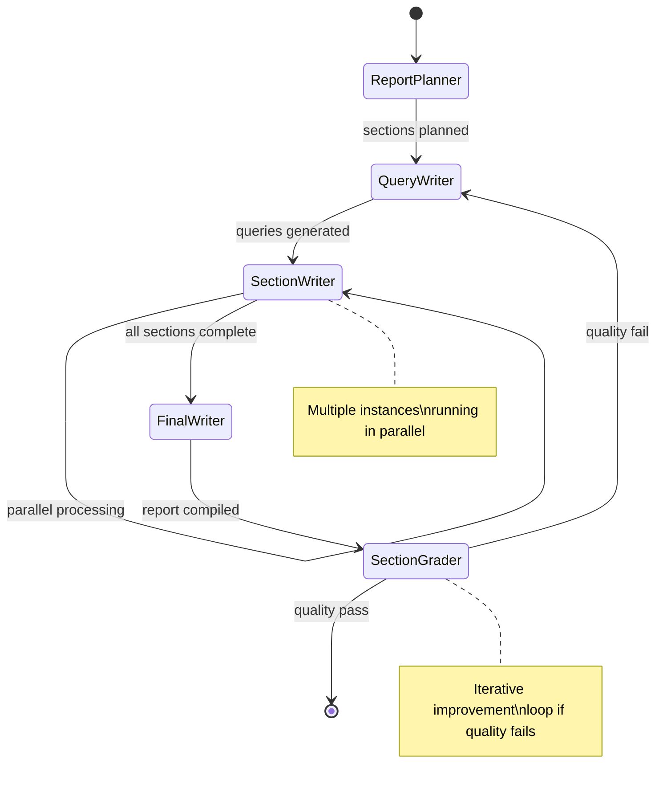
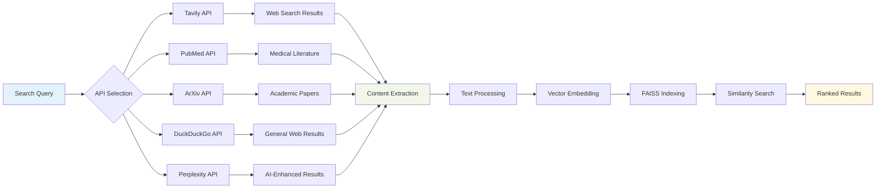
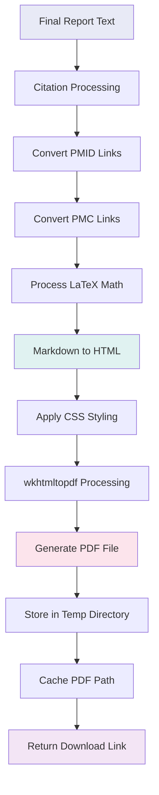
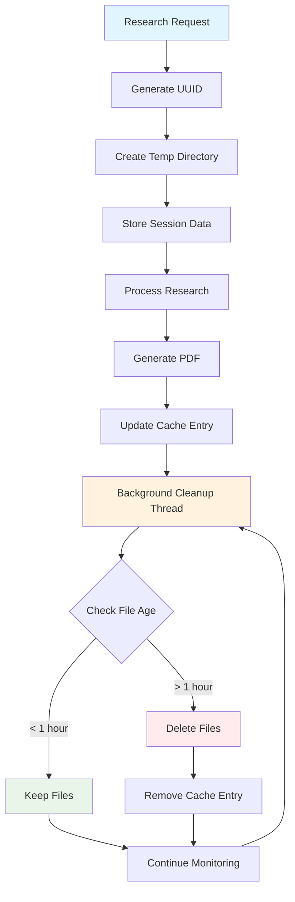
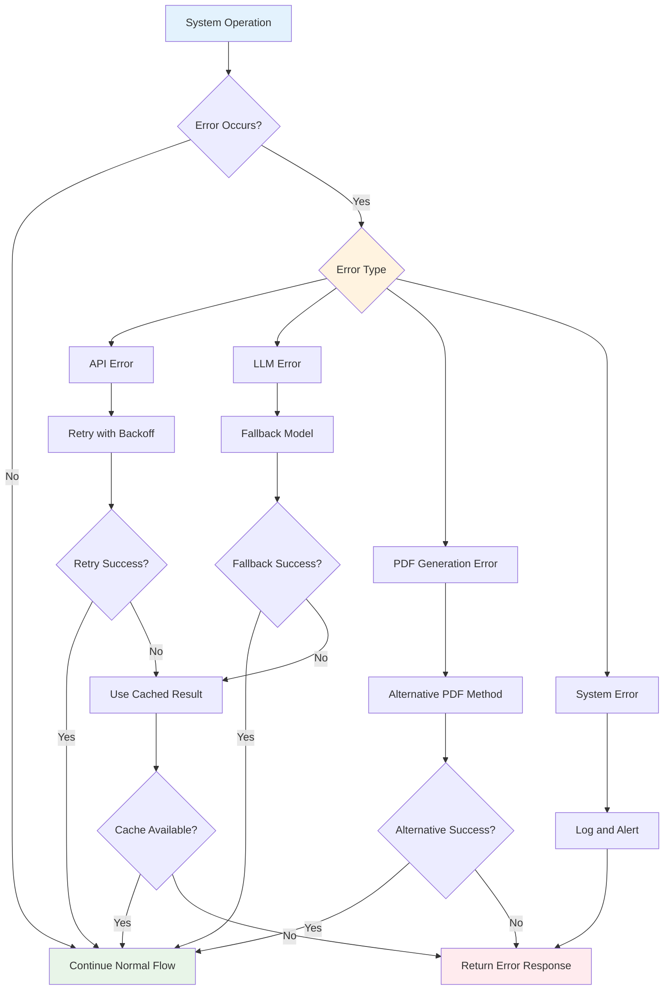

# NeuroDeep Search - System Flow Diagram

## Complete Request Processing Flow

## LangGraph State Machine Flow

## Search API Integration Flow

## PDF Generation Pipeline

## Cache Management System

## Error Handling Flow

